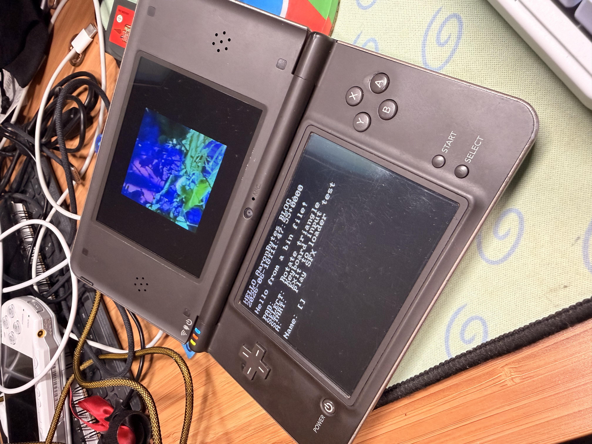

# Introduction

I've been interested in exploring writing some code for the Nintendo DS. I was inspired by the release of the [DSpico](https://www.lnh-team.org/) flashcart. I purchased one and this got me interested in the idea of trying to write some simple homebrew. Not exactly sure what yet, but I figured I'd look into what the development environment looks like. 

Parallel to this, I started to wonder if there was a way setup a virtual machine or have this environment be containerized somehow. I breifly looked at Apple's [Container](https://github.com/apple/container) tool. But from a brief search it seems this is still not ready for casual development. So instead I started to think maybe this could be done in a Docker container. It would also be prefered if I could write code in VSCode or some other IDE and then also run builds from a terminal. 

# BlocksDS

In searching around I came across [BlocksDS](https://blocksds.skylyrac.net/docs/introduction/) which is an SDK to develop applications for the Nintendo DS. As it turns out they already provide a [Docker Image](https://blocksds.skylyrac.net/docs/setup/docker/)! 

# Setup

## Docker
With all this in mind I set about getting Docker configured on my Mac. I use Docker Compose extensively in my homelab setup, but since I had not installed this on my Mac I first needed to pick a Docker runtime. For this I went with [Colima](https://github.com/abiosoft/colima) as it was open source and pretty easy to setup since I already use `homebrew`. 

I installed Colima with the following command:
`brew install colima docker`


## VSCode
I already had VSCode installed so the only thing left was to install the [Dev Containers](https://marketplace.visualstudio.com/items?itemName=ms-vscode-remote.remote-containers) extension. This allows VSCode to edit the code that is stored on disk, while also providing a terminal that is scoped to the container's context. This allows me to interact with the SDK components that are running in the container. 


## Time to Build!
The goal is to compile a NDS ROM as shown in the end of https://blocksds.skylyrac.net/docs/setup/docker/. 

I created a new directory and within created a `.devcontainer` folder. Within that I created a `devcontainer.json` file with the following:

```json
{
  "name": "BlocksDS (NDS homebrew)",
  "image": "skylyrac/blocksds:slim-latest",
  "workspaceFolder": "/work",
  "workspaceMount": "source=${localWorkspaceFolder},target=/work,type=bind",
  "customizations": {
    "vscode": {
      "extensions": [
        "ms-vscode.cpptools",
        "ms-vscode.makefile-tools"
      ]
    }
  }
}
```

Since I'm not interested in modifying BlocksDS I'm using the `blocksds:slim-latest` image. This configuration will bind the local project directory to a `/work` folder within the Docker container. Once we ensure colima is running, we can start VSCode from the local project directory. We can then start the dev container via the command pallet. This is how we bridge the host OS and the Docker container. Within VSCode we can write our code and then from VSCode's terminal we have a terminal scoped to the Docker container from which we can run our builds. 

Within the `sdk/templates` directory there is a `rom_arm9_only` directory. Within this directory we will modify `source/main.c` and add a line to print some text to the screen

```c
// Print some text in the demo console
// -----------------------------------

  consoleClear();
  printf("HELLO AaronBytes BLOG.\n"); // Our change!

// Print current time
  char str[100];
  time_t t = time(NULL);
  struct tm *tmp = localtime(&t);
  if (strftime(str, sizeof(str), "%Y-%m-%dT%H:%M:%S%z", tmp) == 0)
    snprintf(str, sizeof(str), "Failed to get time");
```

We can build BlocksDS' sample ROM by running `make` within VSCode's terminal in the `/work/sdk/templates/rom_arm9_only` directory. This outputs a `template_arm9.nds` file within this directory. 

We then load this file onto our DSPico and run it!



Now we have a contained dev environment and we can start writing our own NDS programs!