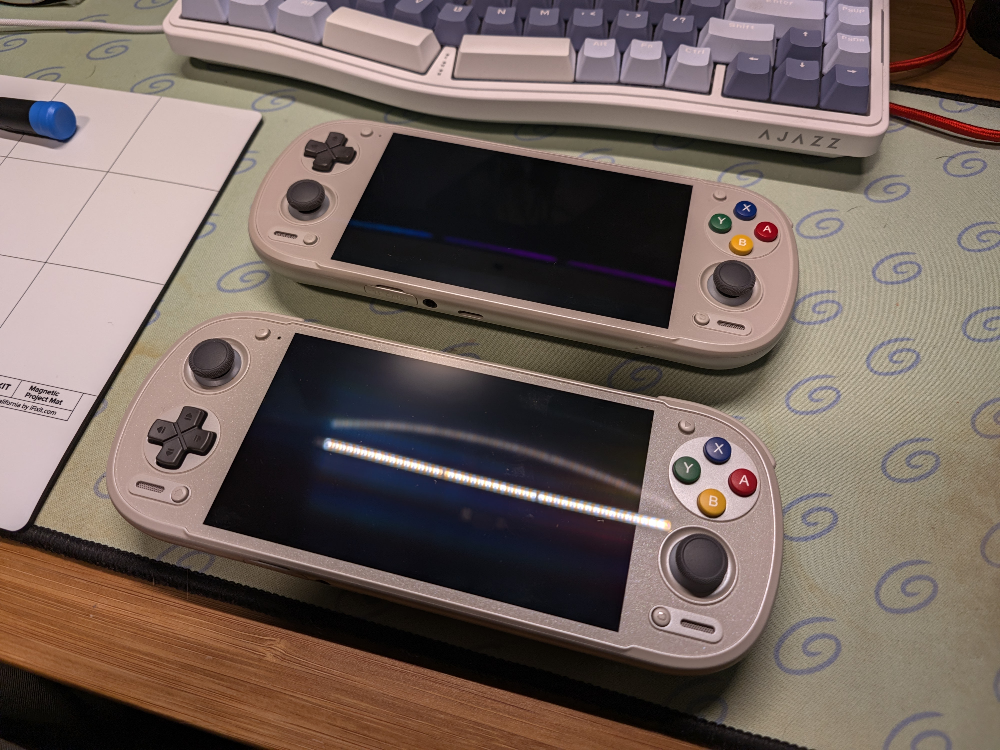
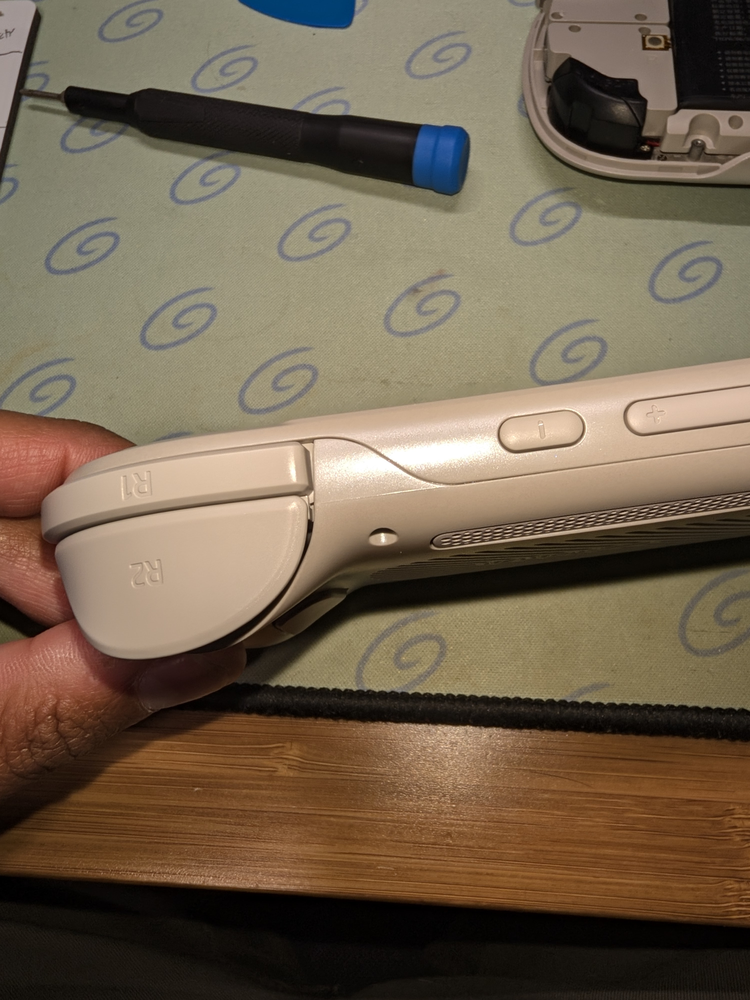
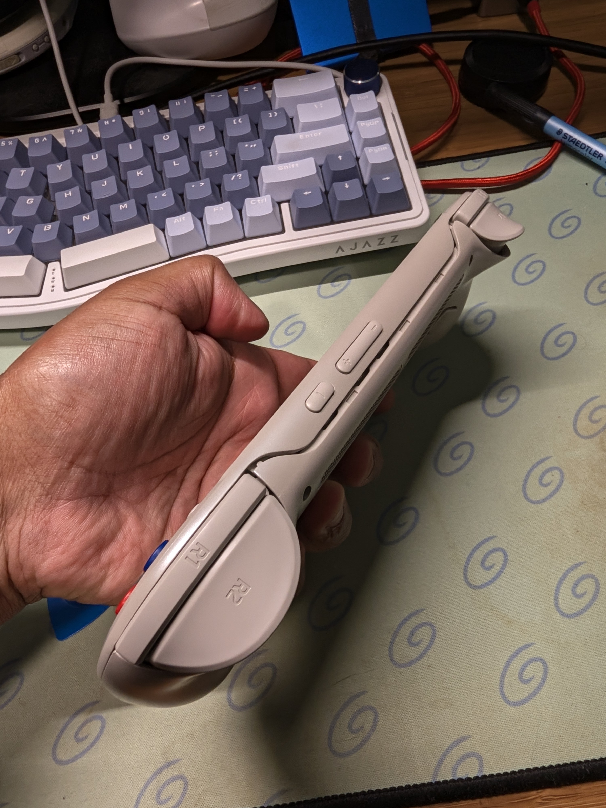
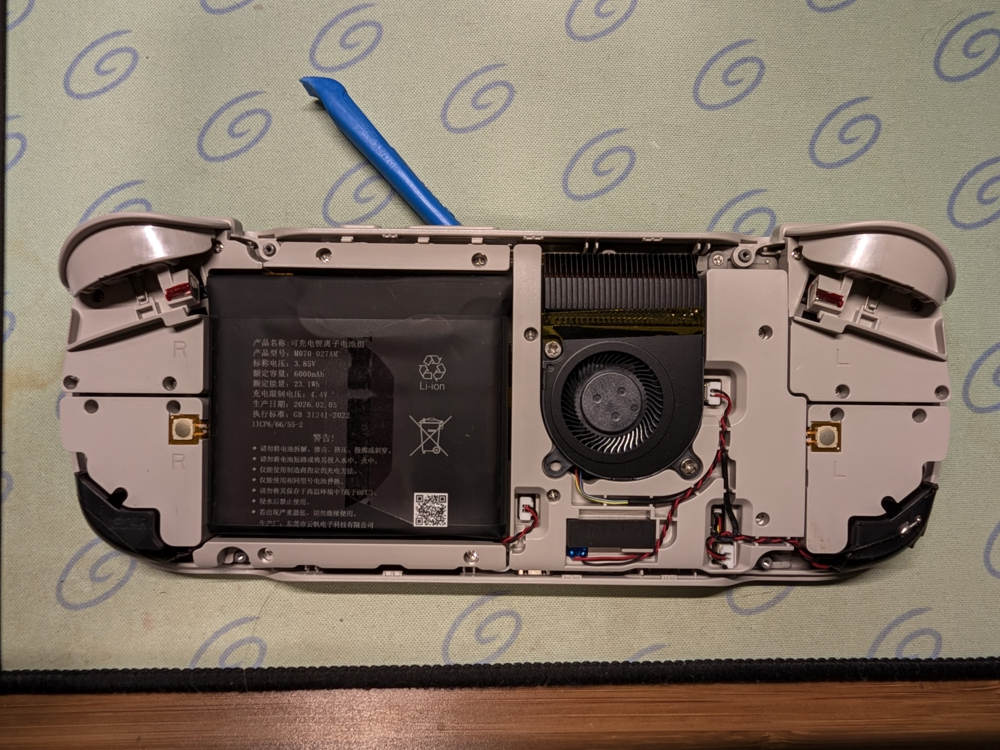
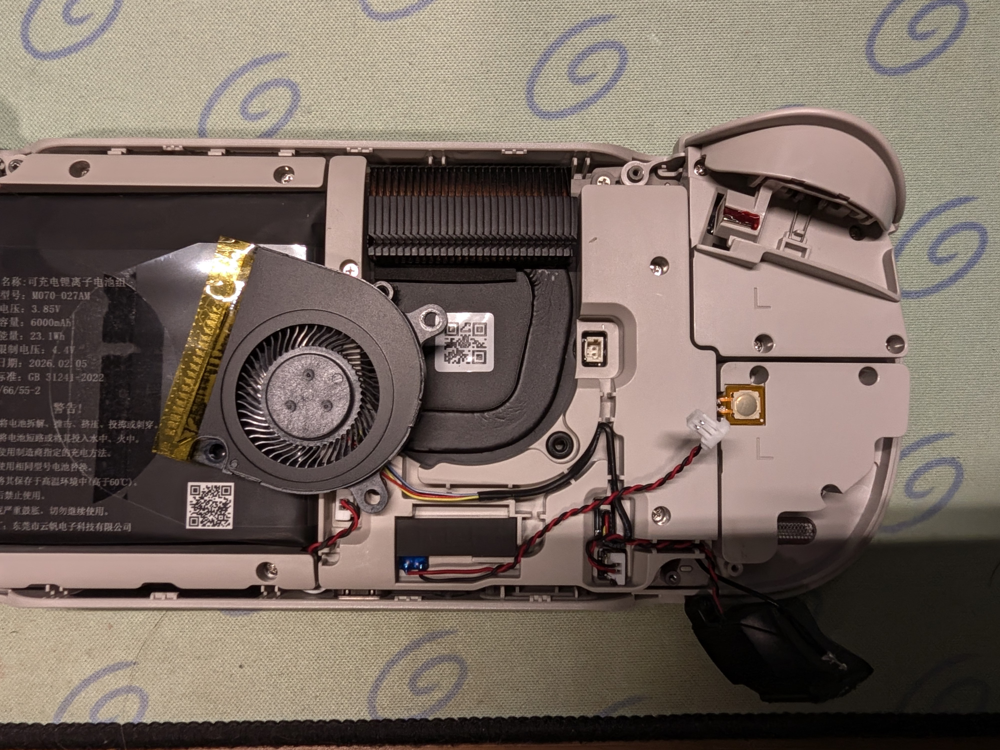
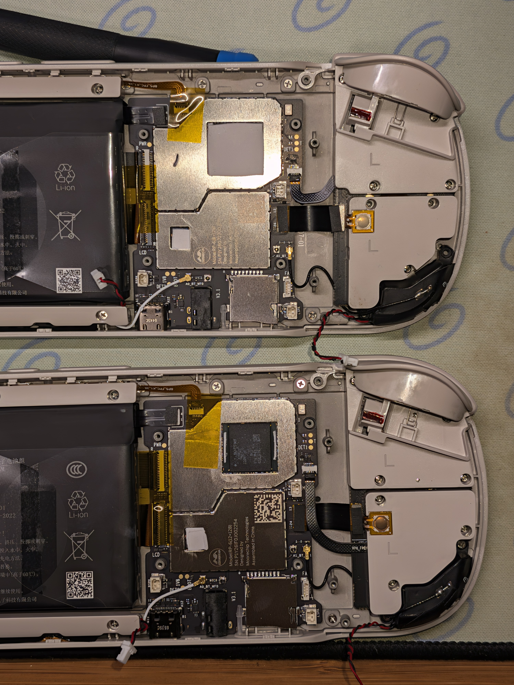
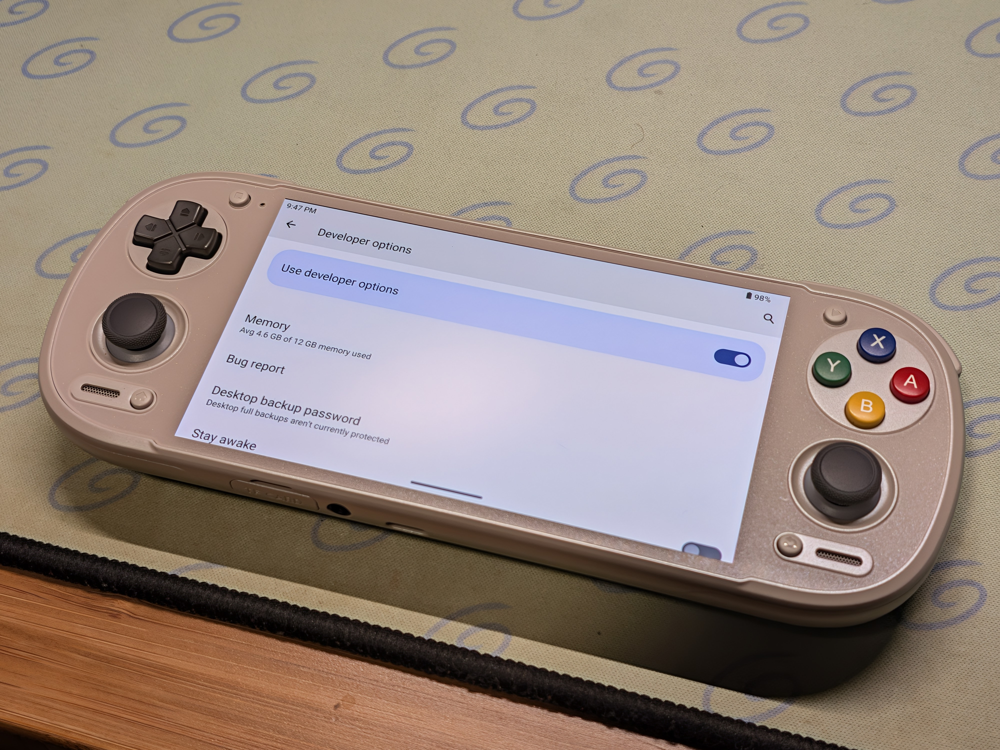
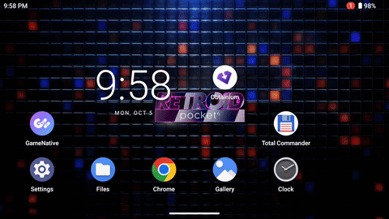

I've been really impressed by the state of modern Android handhelds such as the AYN Thor or the Retroid Pocket 6. Retroid offers a couple of different configurations at the time of writing and after much deliberation I opted for the 8GB console with the D-pad on top. At first this seemed to be sufficient for my needs as I was mostly emulating PS2 and below and I mainly wanted to use this during my work commute. However on a recent trip I remembered that you can play Steam games via apps like GameNative & GameHub. I've been playing through Shin Megami Tensei V Vengeance and figured this would let me make some good progress. 

I installed SMT via GameNative and was off to the races. With the known working config I was able to easily get 45 - 50FPS, however this made the RP6 pretty toasty and the fan was at full speed, so I limited it to 30FPS. Good enough for a portable experience. Gameplay was pretty smooth, I don't think this is particularly a demanding game. But I did notice small stutters as I moved around the overworld. Also I would notice that upon exiting the game my frontend Cocoon would report that it had crashed. I suspected the device was running low on RAM and Android was killing other running apps. 

This started convincing me that having the 12GB RAM version would improve the game's performance and would ultimately be worth it. However, Retroid does not currently sell a 12GB RAM version with D-pad on top, and I really liked the D-pad on top. But this got me thinking, surely internally the RP6 must employ some sort of modular design and the connectors for the controls must be the same just routed to different positions?

I took a gamble and ordered a 12GB D-pad top in the 16-Bit colorway and it arrived in a little under a month.

# Teardown
We start off by removing the four screws on the rear of the unit. I found that the easiest way to separate the shell was to insert a pry tool in-between the R1 bumper and the front plate.

I then pushed the tool towards the middle of the console and the two plates snapped apart without much issue. 

Here is what the console looks like with the rear plate removed.

From here we unplug all the connectors around the middle portion that contains the CPU fan. We remove the CPU fan screws and unplug the CPU fan. 

Once the fan is out, we remove the screws for the middle plastic plate and we get our first glimpse of the D-pad and left joystick connectors. As suspected the motherboard has two connectors for a daughter board that contains the D-pad and joystick. Upon inspection the connectors appear to be the same between the two versions, with only the D-pad ribbon cable differing. 

Below you can see the 8GB version on top and the 12GB version below.

# Swap Magic!

At this point it's simply a matter of unplugging all the connectors and swapping the motherboards. This was mostly easy, however the two connectors on the left were rather difficult to re-insert as they could only be inserted once the board was completely flat. This made it really difficult to get a grip on the ribbon cable as they are really short and close to the battery, so there isn't much room to maneuver. Patience is key here.

Once everything was re-connected I did a quick test before putting everything back together and the console booted up normally! All the buttons worked without issue! Success!!!

Once I loaded up all my emulators on the console I noticed that the joystick controls appeared to be inverted. Not sure exactly why perhaps the joystick orientation differs between the two versions. But I found a [Reddit Post](https://www.reddit.com/r/retroid/comments/1sbtevr/left_stick_is_inverted_but_right_stick_moves_fine/) where someone had a similar issue. 

From that post I found there is a hidden menu to specify the D-pad configuration for the console. 
**To access navigate to System Settings -> Handheld Settings -> Input -> Input Control -> Joystick calibration -> Tap bottom left corner six times**

Once this was done everything worked correctly! To test I loaded up SMT V via GameNative and now I could see the RAM usage was exceeding 7GB whereas before it would hover around 5.8 - 6GB. The stuttering also went away at 30FPS and the game played much smoother now!